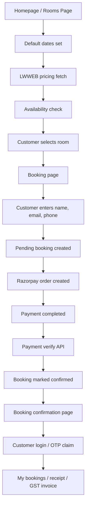
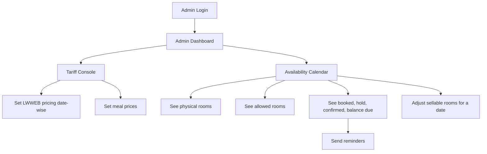
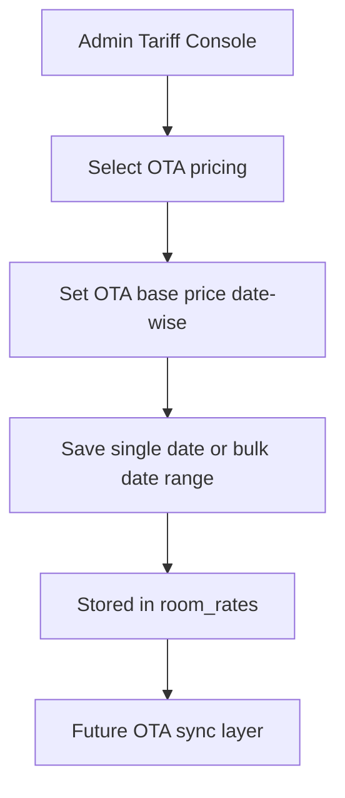
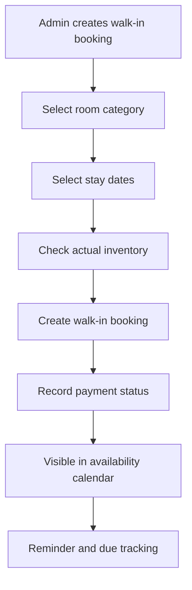
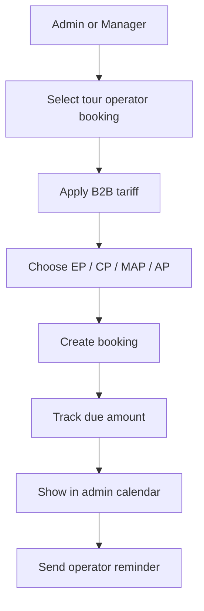
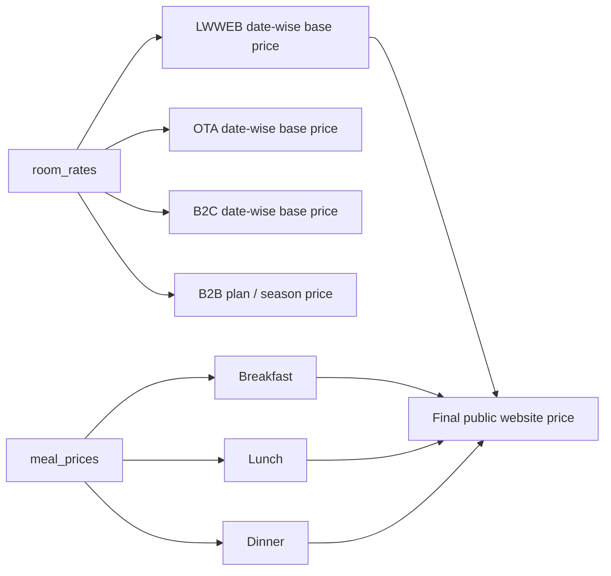
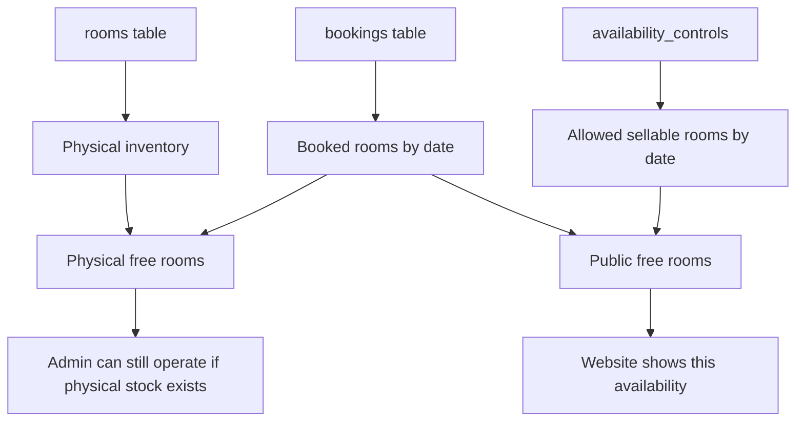

# Leafwalk Resort System Flow Master Document

## 1. Purpose

This document explains the current Leafwalk Resort booking system in a clean operational format so pricing, availability, booking sources, admin controls, payment, and login flows can be understood from one place.

It covers:

- direct website booking flow
- admin direct-booking operations
- OTA pricing and future OTA sync provision
- walk-in booking flow
- tour operator booking flow
- pricing architecture
- availability architecture
- current database dependencies
- current gaps and required next changes

---

## 2. Core Business Model

The system currently supports multiple booking sources:

1. `LWWEB`
   direct website booking

2. `OTA`
   online travel agent pricing and future OTA integration

3. `B2C`
   walk-in / offline / direct-admin bookings

4. `B2B`
   tour operator / agent bookings

The operational goal is:

- public users should only see `LWWEB`
- admin should be able to manage all commercial sources
- public website availability should follow sellable inventory
- admin should still see actual physical inventory and be able to book operationally

---

## 3. Main System Areas

### Public website

- homepage
- rooms page
- booking page
- booking confirmation
- my bookings

### Admin system

- tariff console
- bookings management
- availability calendar
- room management
- reminder actions

### Shared engines

- date-wise pricing engine
- availability engine
- payment verification
- email notifications

---

## 4. Current Booking Source Rules

## LWWEB

- used for public website pricing
- date-wise pricing
- meal prices added dynamically
- shown on homepage, rooms page, booking page

## OTA

- admin managed
- date-wise pricing
- public site does not show OTA price
- future sync/webhook integration planned

## B2C

- walk-in / offline bookings
- admin side use
- not visible on public website

## B2B

- tour operator pricing
- currently matrix / plan based
- EP / CP / MAP / AP rates
- not visible on public website

---

## 5. Direct Website Customer Flow

### What currently happens

- homepage and rooms page use date-wise pricing
- pricing is fetched through the room pricing API
- availability is fetched through the availability API
- booking record is created before payment
- payment verify confirms the booking
- booking confirmation page is shown after payment

### What must always be true

- public pricing should use only `LWWEB`
- public availability should use sellable inventory
- public user should never see B2B / B2C / OTA prices

---

## 6. Admin Direct Booking Operational Flow

### Admin direct-booking functions

- set date-wise direct base price
- set meal components separately
- inspect date-wise booking load
- inspect pending balances
- send email / WhatsApp / SMS reminders
- set allowed sellable rooms date-wise

---

## 7. Admin OTA Functionality

### Current OTA state

- OTA pricing is managed by admin
- OTA pricing is separate from public price
- OTA sync/webhook tables were provisioned as future support

### Future expansion planned

- OTA availability push
- OTA webhook responses
- OTA channel availability mapping

---

## 8. Walk-in Booking Admin Flow

### Intended rule

- walk-in booking should be an admin operational action
- it should consider actual physical inventory
- it should not be blocked just because public sale cap is lower

### Important distinction

- public direct availability uses allowed/sellable rooms
- walk-in should ideally use physical remaining rooms

---

## 9. Tour Operator Admin Flow

### Current B2B status

- B2B plan pricing exists
- operator details show in admin calendar
- pending payments and reminder actions are visible

### Recommended long-term decision

Keep one of these models:

1. keep B2B as matrix-based seasonal pricing
2. eventually move B2B to date-wise pricing too

At present, B2B is still conceptually different from LWWEB / OTA / B2C.

---

## 10. Pricing Architecture

### Direct / OTA / B2C structure

- room price is stored as base room price
- meal price is stored separately
- final price is computed dynamically

### Meal plan rules

- `EP` = room only
- `CP` = room + breakfast
- `MAP` = room + breakfast + dinner
- `AP` = room + breakfast + lunch + dinner

### Public website

- uses `LWWEB` only
- computes final room plan price dynamically

### Tour operator

- currently uses plan-based matrix
- separate operational model

---

## 11. Availability Architecture

### Key concepts

## Physical total rooms

Actual inventory in the property.

Example:

- deluxe = 7 physical rooms
- premium = 10 physical rooms

## Allowed rooms

How many rooms admin wants to keep open for public sale.

Example:

- physical deluxe = 7
- allowed deluxe = 5
- 2 rooms internally blocked or held back

## Blocked rooms

`blockedRooms = totalRooms - allowedRooms`

## Public available rooms

`allowedRooms - bookedRooms`

## Admin physical available rooms

`totalRooms - bookedRooms`

This distinction is very important.

---

## 12. Availability Control Example

Example for `deluxe` on `28 March`:

- physical total = 7
- admin allowed public sale = 5
- already booked:
  - 2 by tour operator
  - 1 direct website
  - 1 walk-in
- total booked = 4

Then:

- public free = `5 - 4 = 1`
- admin physical free = `7 - 4 = 3`

Meaning:

- public website should show only 1 room available
- admin may still create internal bookings using remaining physical stock

---

## 13. Current Main Database Tables

## `rooms`

Purpose:

- physical inventory source
- room category and room counts

Important fields:

- `id`
- `category`
- `total_rooms`
- `is_active`

## `bookings`

Purpose:

- actual reservations

Important fields:

- `room_id`
- `check_in`
- `check_out`
- `rooms_booked`
- `booking_source`
- `booking_status`
- `payment_status`
- `advance_amount`
- `balance_amount`
- `payment_due_date`
- `user_id`

## `room_rates`

Purpose:

- pricing store

Used for:

- LWWEB date-wise base price
- OTA date-wise base price
- B2C date-wise base price
- B2B plan matrix

## `meal_prices`

Purpose:

- breakfast / lunch / dinner pricing

## `availability_controls`

Purpose:

- admin-controlled sellable inventory caps per category and date

Status:

- required
- should exist in Supabase

SQL file:

- [D:\Leafwalk Web Dev\for upload\leafwalk-enhanced\database\availability-controls.sql](D:\Leafwalk Web Dev\for upload\leafwalk-enhanced\database\availability-controls.sql)

---

## 14. Main APIs Involved

## Public side

- room pricing
  - [D:\Leafwalk Web Dev\for upload\leafwalk-enhanced\app\api\get-room-pricing\route.ts](D:\Leafwalk Web Dev\for upload\leafwalk-enhanced\app\api\get-room-pricing\route.ts)

- public availability
  - [D:\Leafwalk Web Dev\for upload\leafwalk-enhanced\app\api\check-availability\route.ts](D:\Leafwalk Web Dev\for upload\leafwalk-enhanced\app\api\check-availability\route.ts)

- create booking
  - [D:\Leafwalk Web Dev\for upload\leafwalk-enhanced\app\api\bookings\create\route.ts](D:\Leafwalk Web Dev\for upload\leafwalk-enhanced\app\api\bookings\create\route.ts)

- payment verify
  - [D:\Leafwalk Web Dev\for upload\leafwalk-enhanced\app\api\payments\verify\route.ts](D:\Leafwalk Web Dev\for upload\leafwalk-enhanced\app\api\payments\verify\route.ts)

## Admin side

- admin availability calendar
  - [D:\Leafwalk Web Dev\for upload\leafwalk-enhanced\app\api\admin\availability-calendar\route.ts](D:\Leafwalk Web Dev\for upload\leafwalk-enhanced\app\api\admin\availability-calendar\route.ts)

- admin general data / booking operations
  - [D:\Leafwalk Web Dev\for upload\leafwalk-enhanced\app\api\admin\data\route.ts](D:\Leafwalk Web Dev\for upload\leafwalk-enhanced\app\api\admin\data\route.ts)

- admin reminders
  - [D:\Leafwalk Web Dev\for upload\leafwalk-enhanced\app\api\admin\notify\route.ts](D:\Leafwalk Web Dev\for upload\leafwalk-enhanced\app\api\admin\notify\route.ts)

---

## 15. Current Admin Screens

## Tariff Console

Primary pricing control center:

- [D:\Leafwalk Web Dev\for upload\leafwalk-enhanced\app\admin\tariff\page.tsx](D:\Leafwalk Web Dev\for upload\leafwalk-enhanced\app\admin\tariff\page.tsx)

Used for:

- LWWEB pricing
- OTA pricing
- B2C pricing
- meal pricing
- B2B matrix handling

## Availability Calendar

Operational inventory calendar:

- [D:\Leafwalk Web Dev\for upload\leafwalk-enhanced\app\admin\bookings\calendar\page.tsx](D:\Leafwalk Web Dev\for upload\leafwalk-enhanced\app\admin\bookings\calendar\page.tsx)

Used for:

- date-wise inventory view
- payment due view
- booking details
- reminders
- allowed room control

---

## 16. Current What-Is-Done Summary

These are already substantially implemented:

1. date-wise pricing for website
2. meal price separation
3. dynamic pricing on homepage / rooms / booking
4. per-night stay pricing logic
5. availability API
6. admin availability calendar
7. payment due tracking in admin calendar
8. reminder buttons
9. SMTP email working
10. booking confirmation / invoice direction

---

## 17. Current Required Database Actions

These are important DB actions that must exist for smooth behavior.

## Required now

### `availability_controls`

Must be created.

SQL:

- [D:\Leafwalk Web Dev\for upload\leafwalk-enhanced\database\availability-controls.sql](D:\Leafwalk Web Dev\for upload\leafwalk-enhanced\database\availability-controls.sql)

Without this table:

- admin allowed-room control feature cannot work properly

## Also ensure already created where applicable

- `meal_prices`
- date-wise pricing columns in `room_rates`
- unified pricing support indexes

---

## 18. Current Gaps / Areas Requiring Final Cleanup

### 1. Public vs admin availability policy must be fully enforced everywhere

Need final consistency:

- website should use allowed rooms
- admin walk-in / B2B should use physical remaining rooms

### 2. Admin booking create route needs final inventory policy review

The admin booking route should not accidentally behave like the public website route.

### 3. Authentication direction should be finalized

There were multiple auth direction changes during development:

- Supabase-based auth direction
- custom OTP direction

This should be frozen to one final production path.

### 4. Old overlapping pricing pages should stay only as redirects or be cleaned fully

Single source of truth should remain:

- `/admin/tariff`

### 5. OTA live integration still pending

Pricing exists, but live sync layer is still future work.

---

## 19. Recommended Final Operating Model

Use this as the final operational model:

### Public website

- pricing source = `LWWEB`
- availability source = `allowedRooms`

### Admin walk-in

- pricing source = `B2C`
- availability decision = physical inventory

### Admin direct internal booking

- can still book if physical stock exists

### Tour operator booking

- pricing source = `B2B`
- operator payment tracking and reminders enabled

### OTA

- pricing source = `OTA`
- future sync integration

---

## 20. Important Missing Questions To Freeze

These decisions should be locked clearly:

1. Should B2B remain matrix-based or move to date-wise?
2. Should admin be allowed to overbook physical inventory with warning, or never?
3. Should B2C and OTA also eventually get meal-plan-specific computed pricing exactly like LWWEB?
4. Which auth model is final for customers?
5. Should operator reminders go only to operator, or optionally also to the guest?

---

## 21. Immediate Priority Checklist

### Must do now

1. create `availability_controls` table in Supabase
2. test public availability with allowed-room cap
3. test admin walk-in after cap is applied
4. verify admin calendar save action for allowed rooms

### Next best cleanup

1. freeze auth direction
2. audit admin booking route against physical-vs-sellable logic
3. finish OTA sync layer later

---

## 22. Summary In One Line

The system is moving toward:

- one pricing control center
- one availability engine
- sellable inventory for public users
- physical inventory for admin operations
- unified booking visibility and payment follow-up

